# Операционные системы UNIX/Linux (Базовый).

Установка и обновления системы Linux. Основы администрирования.


## Contents

1. [Установка ОС](#part-1-установка-ос)  
2. [Создание пользователя](#part-2-создание-пользователя)  
3. [Настройка сети ОС](#part-3-настройка-сети-ос)   
4. [Обновление ОС](#part-4-обновление-ос)  
5. [Использование команды  sudo](#part-5-использование-команды-sudo)  
6. [Установка и настройка службы времени](#part-6-установка-и-настройка-службы-времени)  
7. [Установка и использование текстовых редакторов](#part-7-установка-и-использование-текстовых-редакторов)  
8. [Установка и базовая настройка сервиса SSHD](#part-8-установка-и-базовая-настройка-сервиса-sshd)   
9. [Установка и использование утилит top, htop](#part-9-установка-и-использование-утилит-top-htop)   
10. [Использование утилиты fdisk](#part-10-использование-утилиты-fdisk)   
11. [Использование утилиты df](#part-11-использование-утилиты-df)    
12. [Использование утилиты du](#part-12-использование-утилиты-du)    
13. [Установка и использование утилиты ncdu](#part-13-установка-и-использование-утилиты-ncdu)    
14. [Работа с системными журналами](#part-14-работа-с-системными-журналами)     
15. [Использование планировщика заданий CRON](#part-15-использование-планировщика-заданий-cron)    


## Part 1. Установка ОС

* Целью данной части является установка Ubuntu 20.04 Server LTS без графического интерфейса. Для этого переходим на [официальный сайт Ubuntu](https://ubuntu.com/download/server) и скачиваем образ. Устанавливаем образ на virtual box и начинаем процесс установки.  После установки проверяем версию ОС с помощью команды `cat /etc/issue.`

>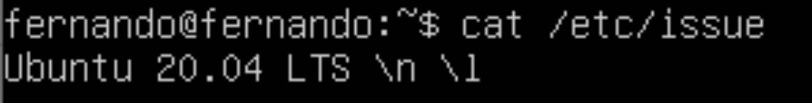
Версия Ubuntu

## Part 2. Создание пользователя

* Целью этой части является создание пользователя и создания для этого пользователя определенных прав.

* Создается новый пользователь при помощи команды useradd.

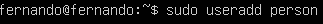

Вызов команды для создания пользователя

* Но новый пользователь не может прочитать логи, для этого мы выдаем ему права с помощью функции usermod и добавляем его в группу adm.

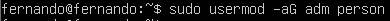

Пользователь получил разрешение на прочтение логов из папки /var/log

* Проверим это:
> 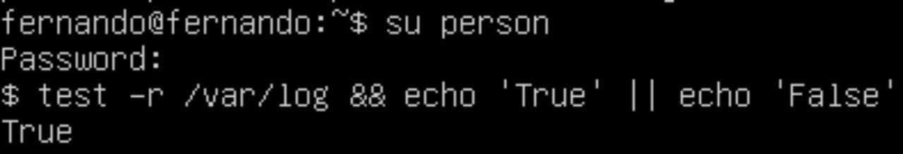
Проверим, есть ли у пользователя права на прочтение логов из /var/log

* Увидим, что новый пользователь есть в выводе команды `cat /etc/passwd`

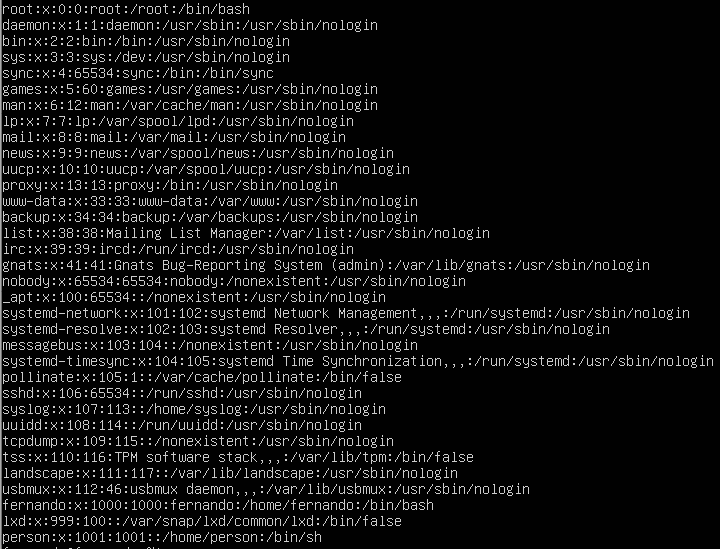

Отображение пользователя в `/etc/passwd`

## Part 3. Настройка сети ОС

* Зададим название машины вида user-1  
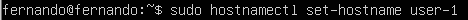

  Задать название машины вида user-1

* Проверка:

> 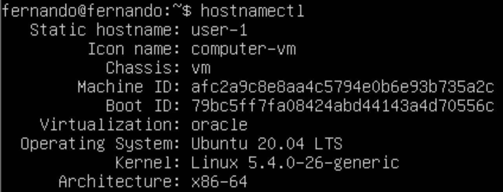
Проверка Static hostname

* Установим временную зону, соответствующую текущему местоположению.
> 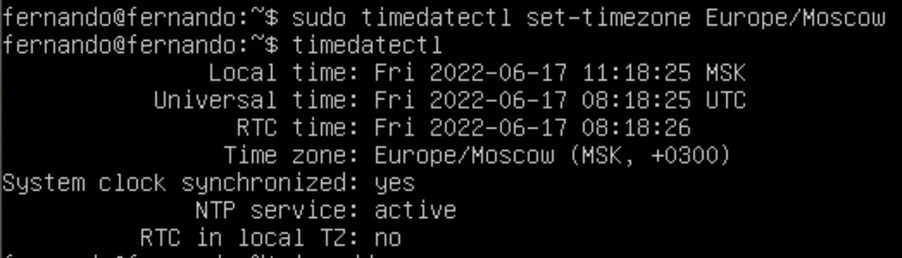
Временная зона Europe/Moscow

* Выведем названия сетевых интерфейсов с помощью консольной команды ip addr.
> 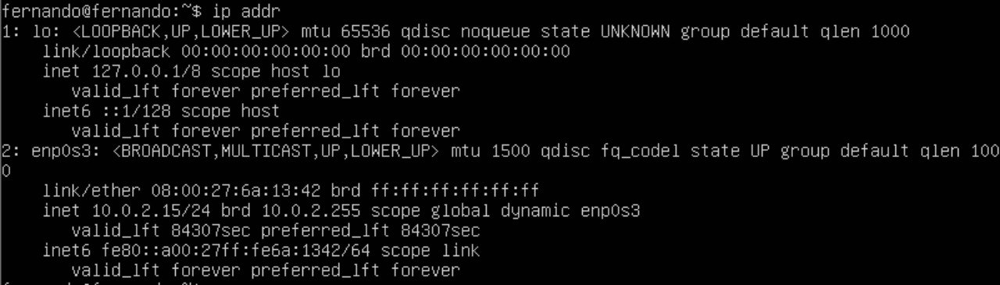
Сетевые интерфейсы

* Интерфейс lo (loopback) - интерфейс обратной петли, относящийся к данному устройству, который позволяет компьютеру обращатся к самому себе. Интерфейс имеет ip-адрес 127.0.0.1. Нужен для того, чтобы устройство всегда могло обратиться само к себе, т.е. одна компонента его программного обеспечения к другой.
* Используя консольную команду, получим ip адрес устройства от DHCP сервера. 
> 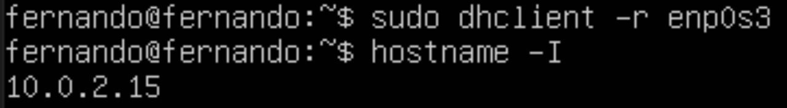
ip адрес устройства от DHCP сервера
 
* Dynamic Host Configuration Protocol (DHCP) - протокол динамического выделения адресов, сетевой сервис, который позволяет компьютерам в сети автоматически получать настройки с сервера вместо того, чтобы настраивать каждый сетевой хост вручную. Автоматически предоставляет IP адреса и прочие настройки сети (маску сети, шлюз и т.п) компьютерам и различным устройствам в сети.

* Определим и выведем на экран внешний ip-адрес шлюза (ip) и внутренний IP-адрес шлюза, он же ip-адрес по умолчанию (gw). 

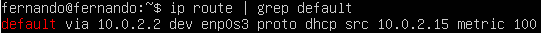

Внутренний IP-адрес шлюза, он же ip-адрес по умолчанию (gw)

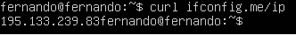

Внешний ip-адрес шлюза (ip)

* Зададим статичные (заданные вручную, а не полученные от DHCP сервера) настройки ip, gw, dns (используем публичные DNS серверы: 1.1.1.1 и 8.8.8.8).  

* Чтобы задать статичный ip,gw,dns мы можем зайти с помощью редактора vim в папку 00-installer-config.yaml и изменить то что нам необходимо.

> 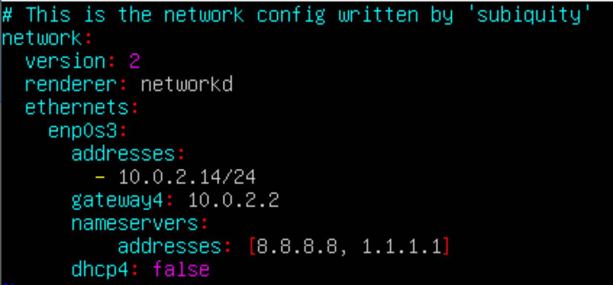
Задаем статичный ip, gw, dns

* Применим изменения настроек

```
sudo netplan apply
```

Перезагрузим виртуальную машину. 

```
reboot
```
* Убедимся, что статичные сетевые настройки (ip, gw, dns) соответствуют заданным в предыдущем пункте.  

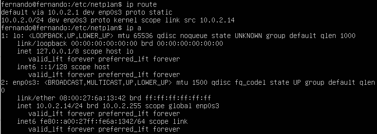

Сетевые настройки

* Выведем DNS серверы, используя команду resolvectl
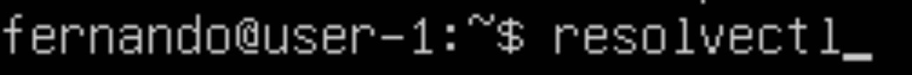
> 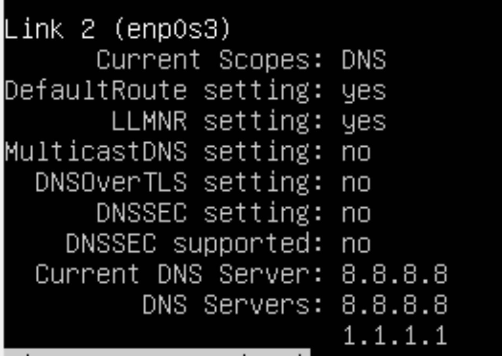
DNS серверы

* Пропингуем удаленные хосты: 1.1.1.1 и ya.ru.

> 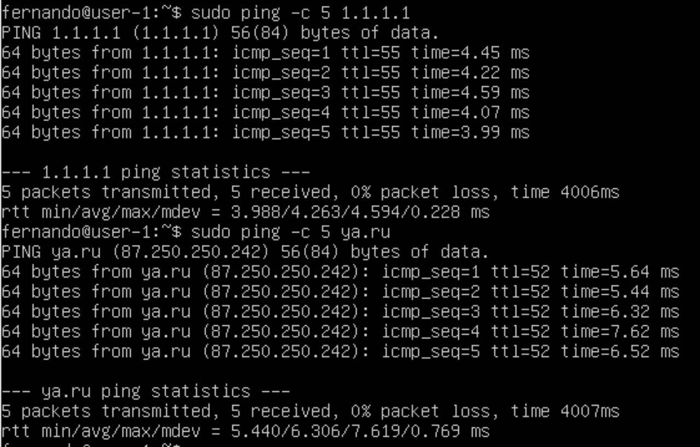
Успешно пропингованы удаленные хосты 1.1.1.1 и ya.ru c ограничием количества отправляемых пакетов с помощью опции -c*

## Part 4. Обновление ОС

* Обновим системные пакеты до последней на момент выполнения задания версии.  

```sudo apt-get update ```
* Команду необходимо выполнить перед обновлением. Будет обновлена информация о пакетах, чтобы в процессе обновления получить самые последние версии пакетов.

```sudo apt-get dist-upgrade ```
* Обновление системных пакетов с использованием умного разрешения конфликтов версий пакетов. При конфликтах пакетов Ubuntu попытается обновить наиболее важные пакеты за счет менее важных. Поэтому команда dist-upgrade может установить дополнительные пакеты или удалить один из конфликтующих пакетов.

* После обновления системных пакетов, если ввести команду обновления повторно, появится сообщение, что обновления отсутствуют.

> 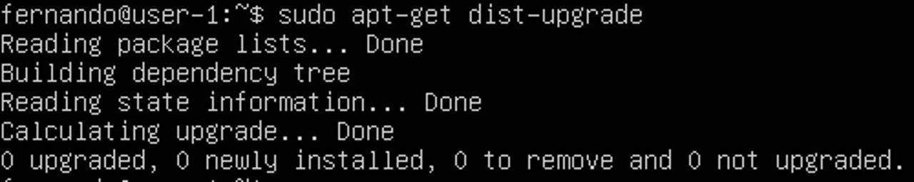
Обновления отсутствуют после попытки повторного обновления системных пакетов

## Part 5. Использование команды **sudo**

* Разрешим пользователю, созданному в [Part 2](#part-2-создание-пользователя), выполнять команду sudo.

* Команда sudo (substitute user and do, подменить пользователя и выполнить ) позволяет строго определенным пользователям выполнять указанные программы с административными привилегиями без ввода пароля суперпользователя root.

* Поменяем hostname ОС от имени пользователя, созданного в пункте [Part 2](#part-2-создание-пользователя) (используя sudo).

* Сначала нужно добавить пользователя в группу sudo
> 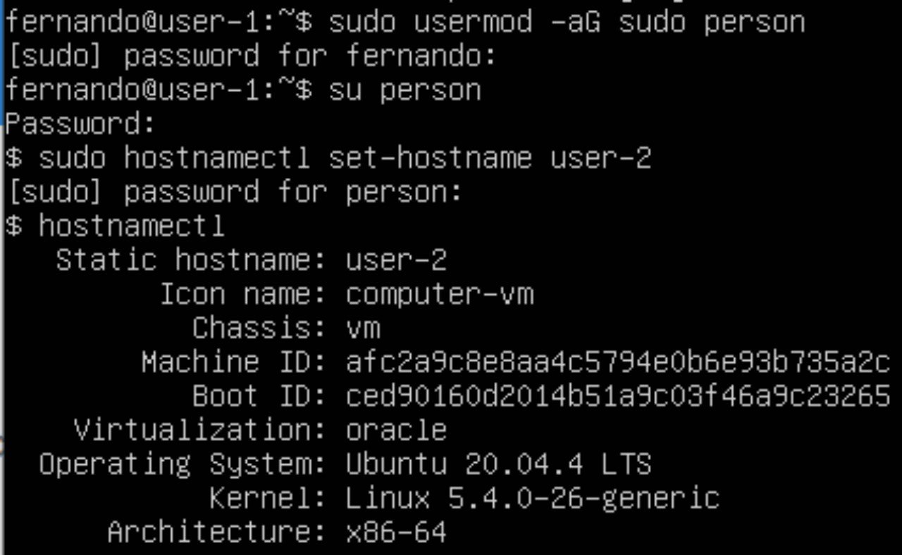
Изменим hostname

## Part 6. Установка и настройка службы времени

* Настроить службу автоматической синхронизации времени.  

* Выведем время, часовой пояс.

> 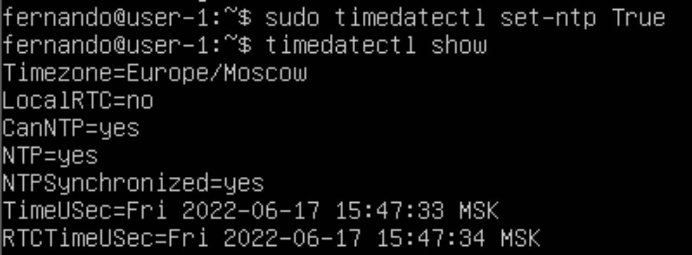
Настройка службы времени

* Включите синхронизацию времени (если ещё не включено)
```
timedatectl set-ntp True
```
## Part 7. Установка и использование текстовых редакторов 

* Используем текстовые редакторы **VIM**, **NANO**, и **JOE**.  
* Установим Joe
```
sudo apt install joe
```
* Создадим файл *test_X.txt*, где X -- название редактора, в котором создан файл. Напишем в нём свой никнейм, закроем файл с сохранением изменений.  

## Vim
> 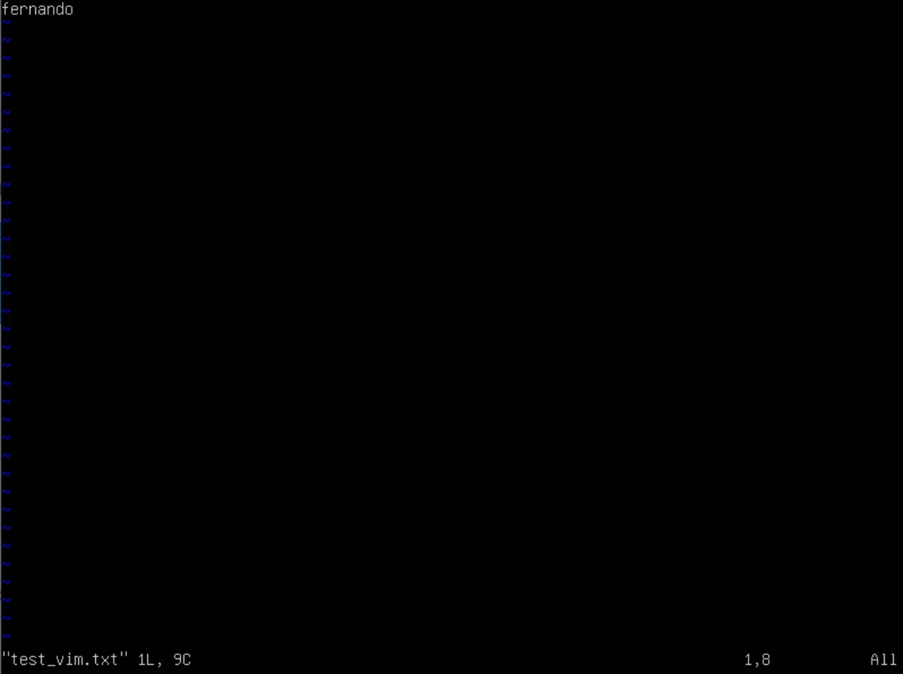
Shift + esc + : + wq! - Команда для выхода из Vim с сохраением изменений

## Nano
> 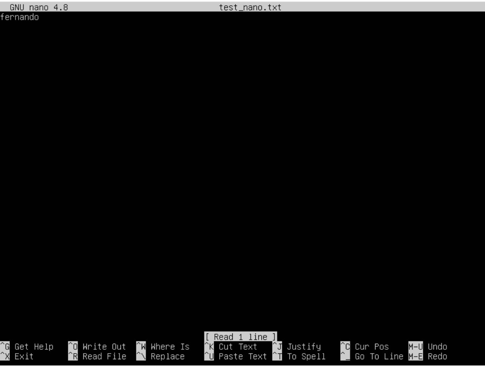
Для выхода нажмите Ctrl + X, подтвердите сохранение

## Joe
> 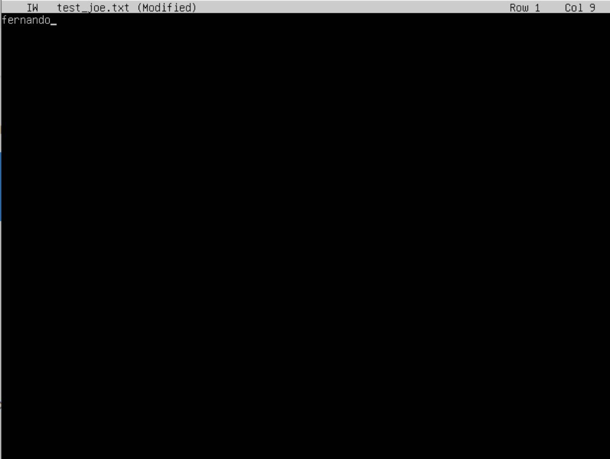
Для выхода с сохранением изменений нажмите Ctrl + k, затем q и после этого подтвердите выход, нажав y.

* Теперь откроем файл на редактирование, отредактируем файл, заменим никнейм на строку "21 School 21", закроем файл без сохранения изменений.

## vim
* Перейдите в режим редактирования i
* Напишите текст, и перейдите в режим команд (ESC + ```:```)
* Выйдите без сохранения (!q, Enter)
        


## nano
* Отредактируйте текст
* Нажмите сочетание Ctrl + X для выхода
* Отмените сохранение отредактированного файла
        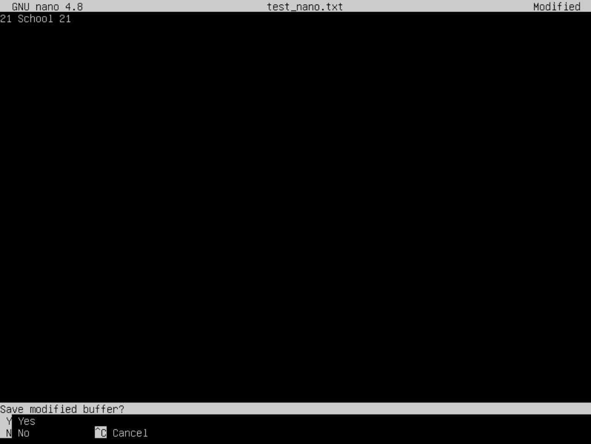

## joe
* Отредактируйте текст
* Нажмите сочетание Ctrl + K + Q
* Отмените сохранение изменений (n)
        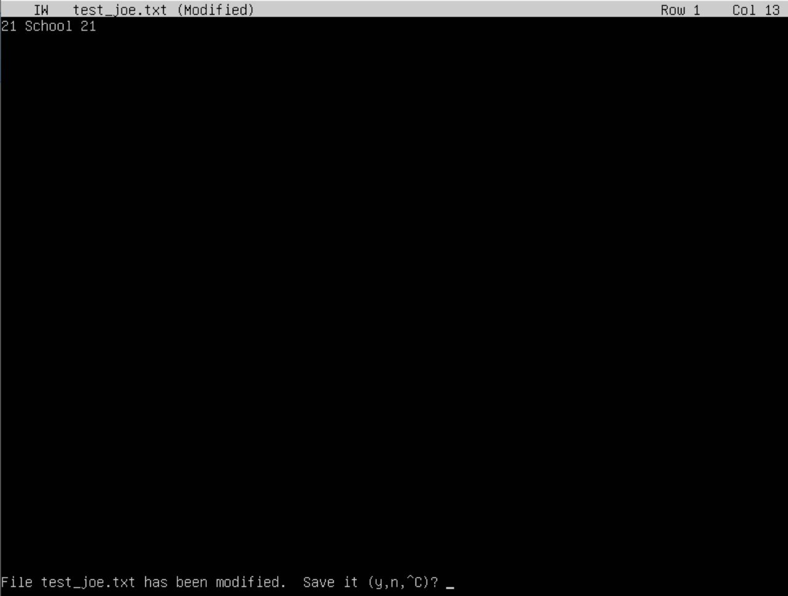

* Далее тредактируем файл ещё раз (по аналогии с предыдущим пунктом), а затем применим функции поиска по содержимому файла (слово) и замены слова на любое другое.

## vim
* Основные действия по поиску в Vim:
Например, для поиска «fer» вы должны использовать ```/\<fer\>``` в строке командного режима
Нажмите Enter, чтобы выполнить поиск.
Нажмите n, чтобы найти следующее вхождение или N чтобы найти предыдущее вхождение.
> 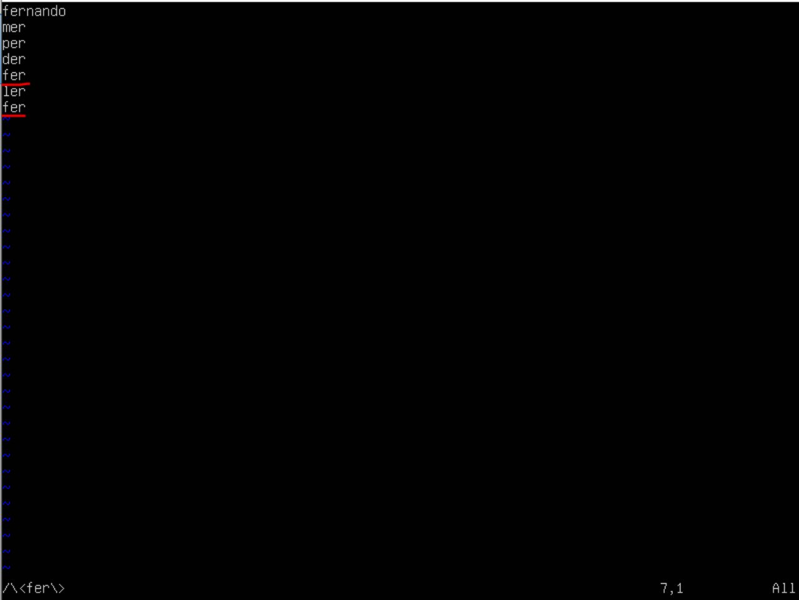
При помощи n/N мы передвигаемся только по заданным словам

* Предположим, вы хотите заменить в тексте каждое слово ```aaa```
словом ```lalala```.

* Используйте команду :
  ```:%s/\<aaa\>/lalala/g```
* Команда состоит из - ```:```
* Вход в командный режим - ```%```
* Выполнить эту команду на всех строках (```%``` - синоним "от
первой до последней строки".)
* ```s``` - cокращенная форма команды :substitute.
* ```/\<aaa\>/``` - это выражение определяет текст. 
* ```/\<``` отмечает начало слова и ```\>``` - его конец.
* ```/lalala/``` - Подставляемый текст
* ```g``` - глобальный флаг - этот флаг говорит Vim заменить каждое вхождение на лини, то есть не только первое.


## nano
Вы можете искать текст внутри файла с помощью комбинации Ctrl + W
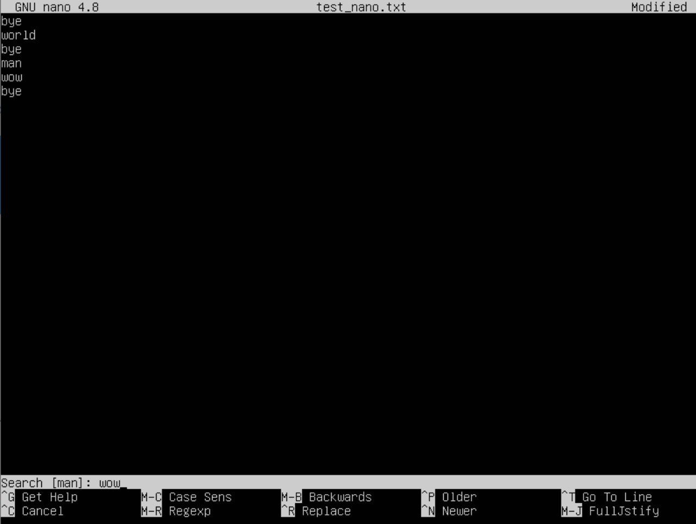

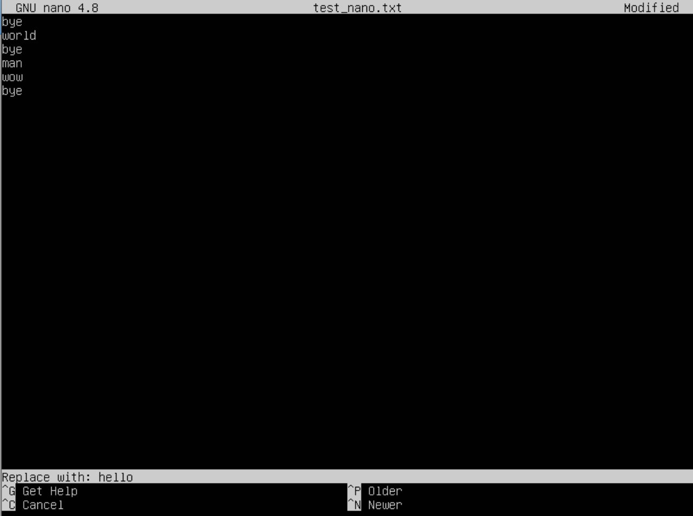

* В редакторе нано, нажмите ```Ctrl + \```, В нижней части окна редактора попросит нас ввести слово или фразу, чтобы заменить ```(Search (to replace): [старое слово])```. Enter после ввода текста подлежит замене.
* Представляем новый текст, который заменит текст из первого пункта. ```(Replace with:). Enter```.
* Далее будет задаваться вопрос ```Replace this instance?```
* Нажмите ```y``` - заменить все найденные фразы / слова.
* Затем редактор пройдется по всем словам в тексте и запросит их изменения.
* В конце будет выдан отчет: ```Replaced (количество) occurences```.

## joe
* Нажмите ```^K F```, чтобы выполнить поиск фрагмента текста 
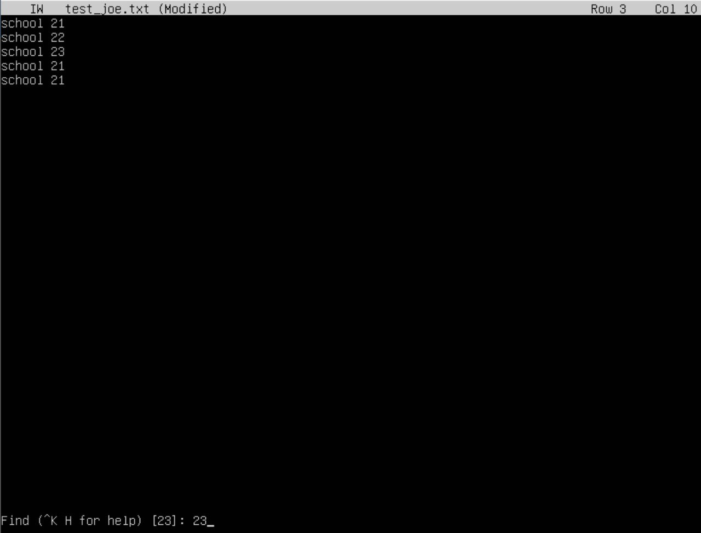

* Нажмите ```^K F```
```Find (^K H for help) [старое]: что заменить?```
* Выбираем опцию
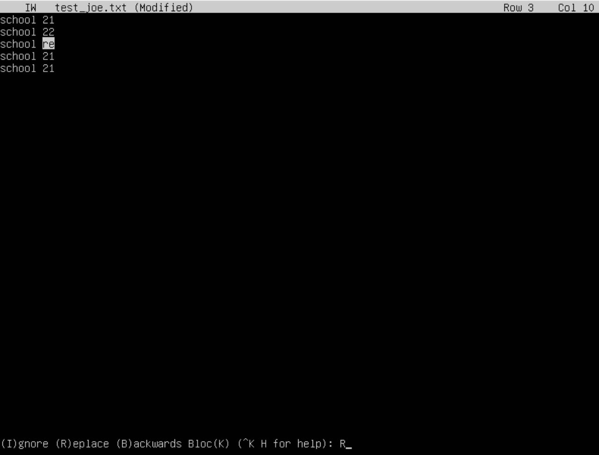
```Replace with (^K H for help): на что изменить?```
```Replace (Y)es, (N)o, (R)est, (B)ackup (^C to abort)?```
* После этого нажимаем ```Y``` и слово должно замениться

## Part 8. Установка и базовая настройка сервиса **SSHD**

##### Установить службу SSHd.  
* Install the SSHd service.
    ```bash
    apt install openssh-server
    ```
##### Добавить автостарт службы при загрузке системы.  
При установке openssh-server сервис добавится в автозагрузку по умолчанию. Если этого не сделано, включим сервис
> 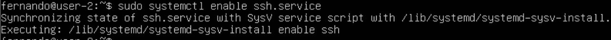
Включение ssh.service

##### Перенастроить службу SSHd на порт 2022.  
* Reset the SSHd service to port 2022.
    ```bash
    sudo cp /etc/ssh/sshd_config /etc/ssh/sshd_config.original
    sudo vim /etc/ssh/sshd_config
    ```
> 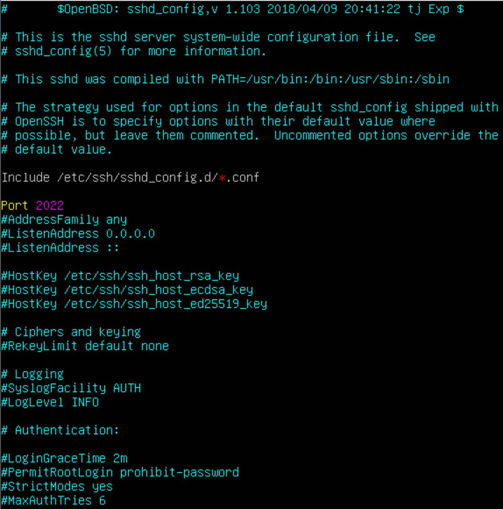
Перенастройка службы SSHd на port 2022

* Раскомментируем и заменим строчку с Port на 2022

* Перезапустим сервис
    ```bash
    systemctl restart sshd.service
    ```
##### Используя команду ps, показать наличие процесса sshd. Для этого к команде нужно подобрать ключи.

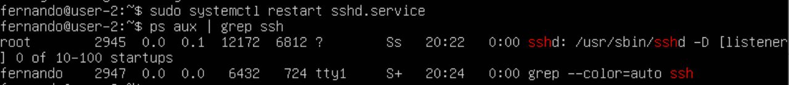


```ps aux | grep ssh```


* a - BSD style. Снимает ограничения на пользователя. То есть начинает показывать процессы не только этого пользователя, но всех
* x - BSD style. Снимает ограничения на процессы  подключенные к терминалу. То есть показывает все выполняемые процессы
* u - Показывает процессы в виде удобном для пользователя
* | grep ssh - показать только процессы в которых есть `ssh`

##### Перезагрузить систему.
* Reboot the system
    ```bash
    reboot
    ```

* Если команды netstat нет, то ее нужно установить
* Для установки утилиты необходимо установить пакет net-tools

```bash
sudo apt install net-tools
```
* Для проверки состояния сети используется команда netstat.
```bash
    netstat -tan
```
* Ключи:
    - t — показывать порты tcp
    - a - показывать все
    - n - показывать "номера" вместо попытки определить хост, порт и пользователя
* Колонки:
    - Proto - протокол (tcp/udp)
    - Recv-Q - количество байт не скопированных программой подключенной к этому сокету
    - Send-Q - количество байт не принятых удаленным хостом 
    - Local Address - локальный адрес сокета
    - Foreign Address - адрес и порт удаленного хоста

    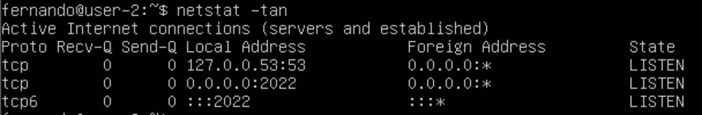

## Part 9. Установка и использование утилит **top**, **htop**

##### Установить и запустить утилиты top и htop.  

  - uptime: 43 min
  - количество авторизованных пользователей: 1
  - общая загрузка системы: 0.00, 0.00, 0.00
  - общее количество процессов: 94
  - загрузка cpu: 0.0 системные процессы, Свободно 100.0
  - загрузка памяти: 3333.6 MB свободно
  - pid процесса занимающего больше всего памяти: 617 snapd
  - pid процесса, занимающего больше всего процессорного времени: 1455
 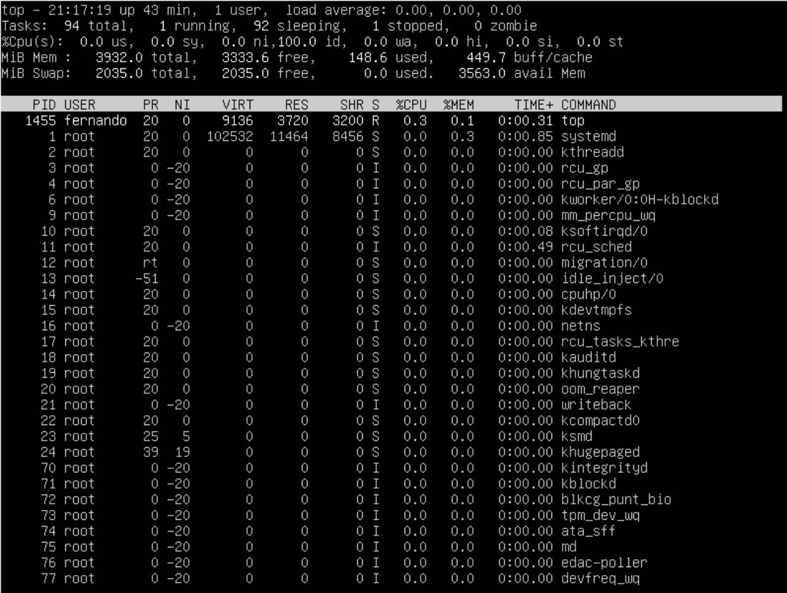
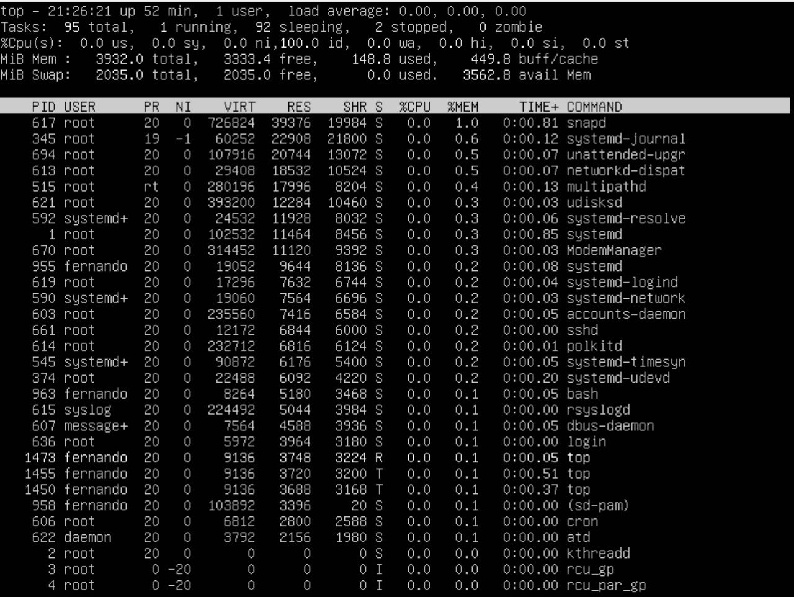

 * Сортировка по PID, PERCENT_CPU, PERCENT_MEM, TIME
   ```
   htop -s TIME/PID/PERCENT_CPU/PERCENT_MEM
   ```
   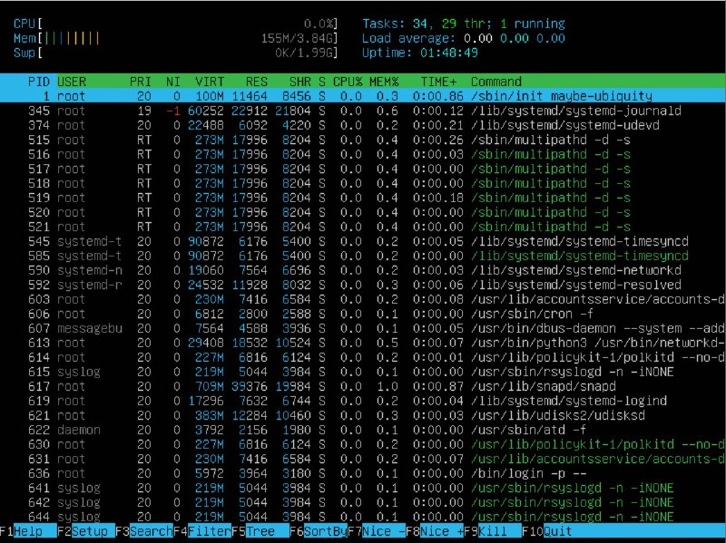

  Сортировка по PID

   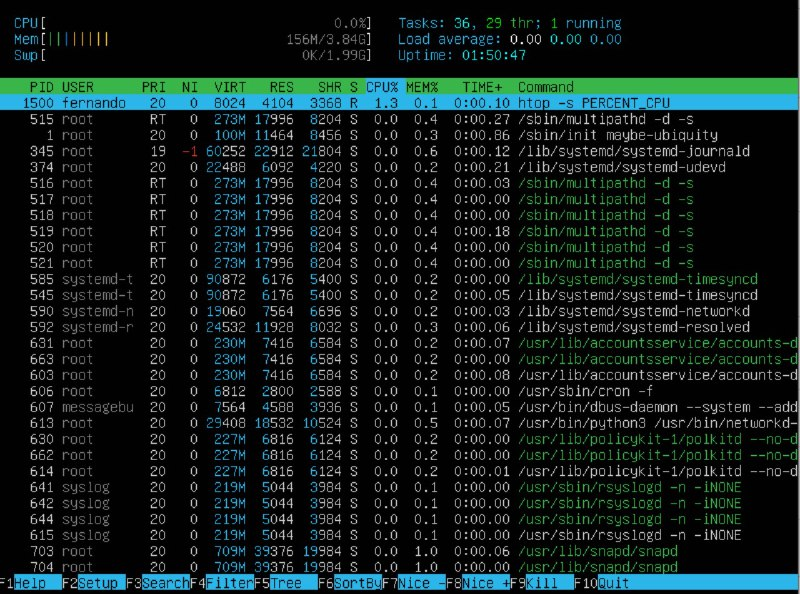

   Сортировка по PERCENT_CPU

   > 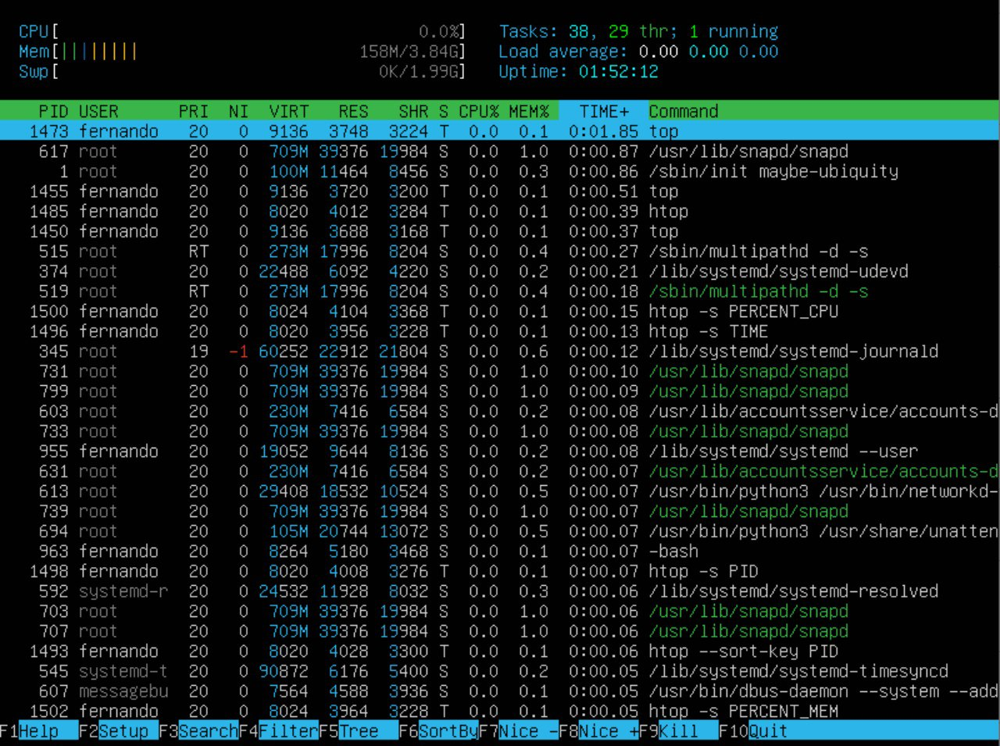
   Сортировка по TIME

   > 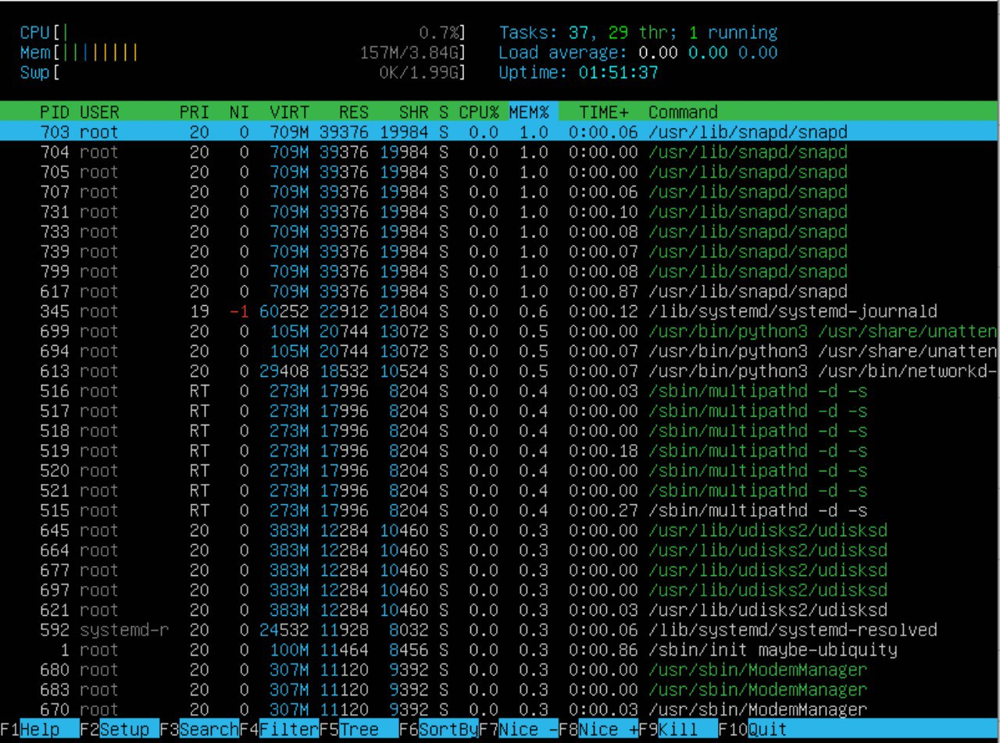
   Сортировка по PERCENT_MEM

* Отфильтруем для процесса sshd

   > 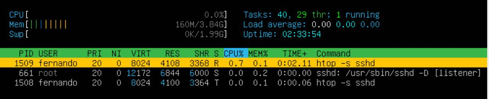
   Отфильтруем для процесса sshd

* C процессом syslog используя поиск 

   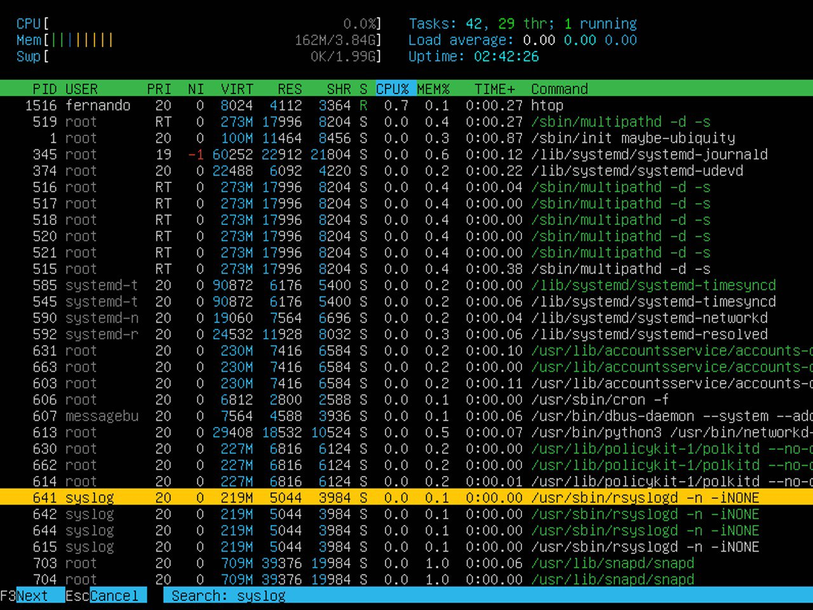

* C добавленным выводом hostname, clock и uptime  
  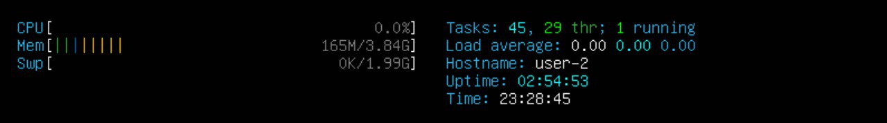

## Part 10. Использование утилиты **fdisk**


##### Запустить команду fdisk -l.

- В отчёте написать название жесткого диска, его размер и количество секторов, а также размер swap.
 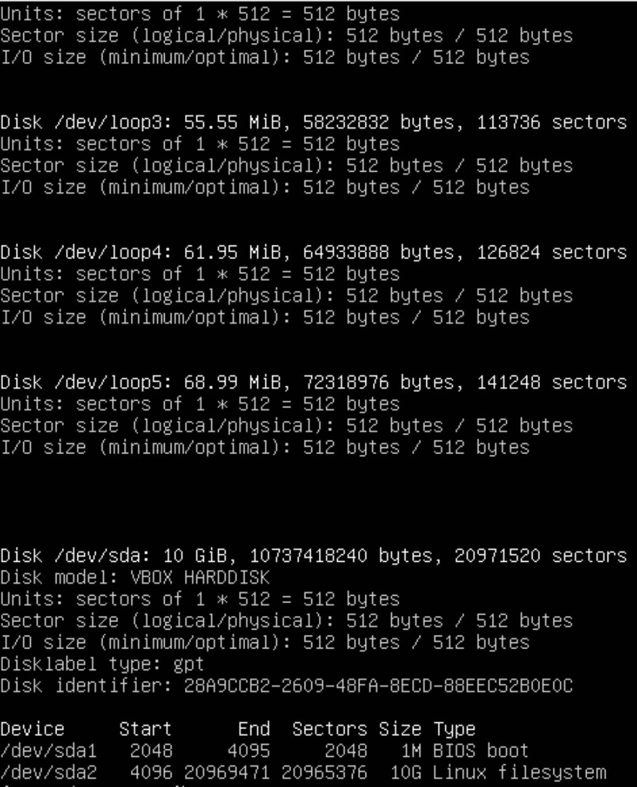

* Disk name: /dev/sda
* Capacity: 10737418240 bytes
* Number of sectors: 20971520 sectors
* Swap size: 2GB (можно посмотреть командой swapon)

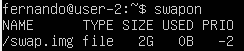

## Part 11. Использование утилиты **df** 

  - размер раздела: 10252564
  - размер занятого пространства: 5699020
  - размер свободного пространства: 4013028
  - процент использования: 59%
  - единица измерения: Kilobyte
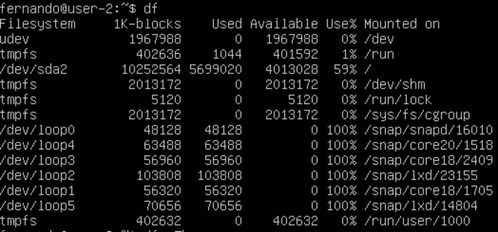

##### Запустить команду df -Th.

  - размер раздела: 9.8 G
  - размер занятого пространства: 5.5 G
  - размер свободного пространства: 3.9 G
  - процент использования: 59 %
  - Тип файловой системы для раздела: ext4
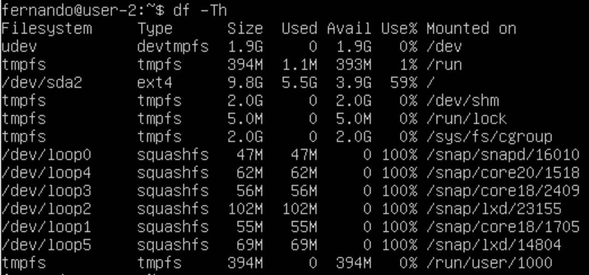

## Part 12. Использование утилиты **du**

##### Запустить команду du.
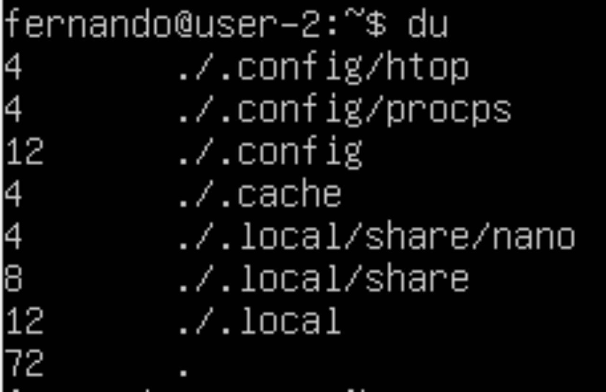

##### Вывести размер папок /home, /var, /var/log (в байтах, в человекочитаемом виде)
> 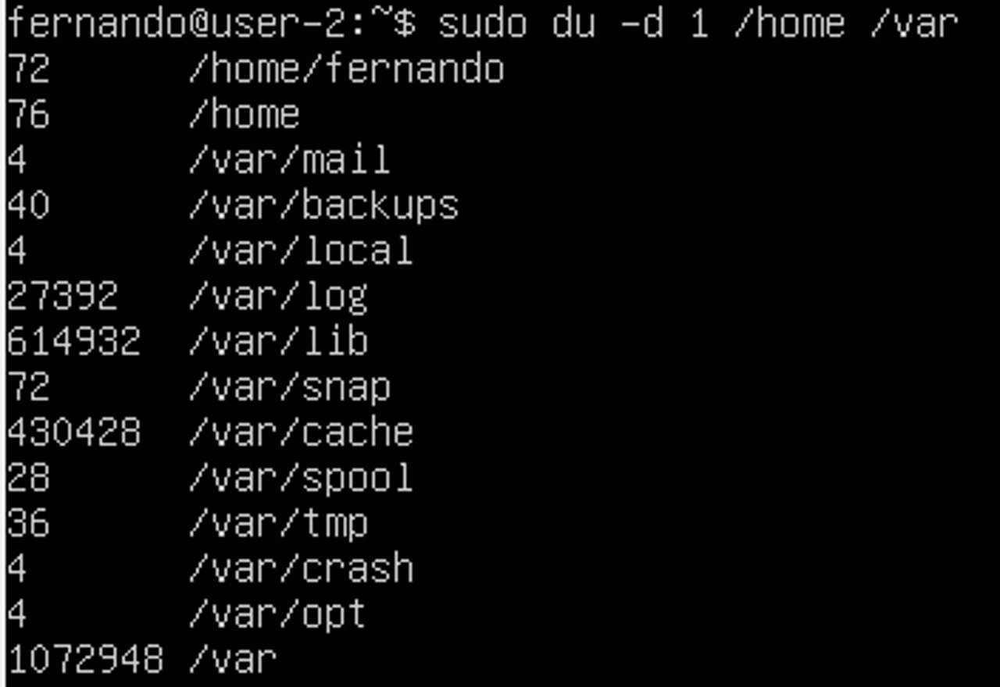
/home, /var

> 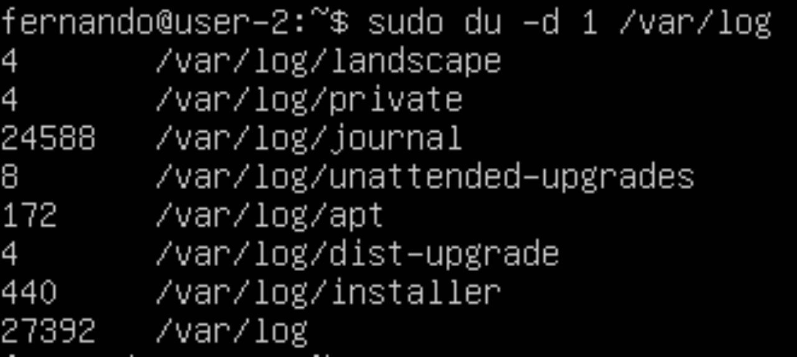
/var/log

##### Вывести размер всего содержимого в /var/log (не общее, а каждого вложенного элемента, используя *)
> 
/var/log


## Part 13. Установка и использование утилиты **ncdu**


##### Установить утилиту ncdu.
```
sudo apt install ncdu
```
##### Вывести размер папок /home, /var, /var/log.

- /home 


/home 

- /var


/var

- /var/log


/var/log

## Part 14. Работа с системными журналами

* Время последней успешной авторизации, имя пользователя и метод входа в систему.


* Время последней успешной авторизации: 18:30:38
* Имя пользователя: person
* Метод входа в систему: ssh

* Перезапустим службу SSHd.

```bash
systemctl restart sshd.service
```


Cообщение о рестарте службы

## Part 15. Использование планировщика заданий **CRON**

##### Используя планировщик заданий, запустите команду uptime через каждые 2 минуты.

```bash
    crontab -e
```


- Вывести на экран список текущих заданий для CRON.


- Вставить в отчёт скрины со строчками о выполнении и списком текущих задач.

```bash
    crontab -l
```


##### Удалите все задания из планировщика заданий.

